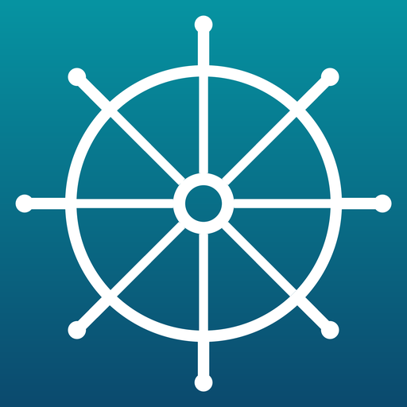

<p align="center">
  
</p>

<h1 align="center">Dockwright</h1>

<p align="center">
  <strong>Your Mac. Your AI. No cloud required.</strong>
</p>

<p align="center">
  A native macOS AI assistant that sees your screen, hears your voice,<br>
  runs your tools, and remembers what matters — built entirely in Swift.
</p>

<p align="center">
  
  
  
  
</p>

---

## What is Dockwright?

Dockwright is a fully native macOS assistant — not a wrapper around a web app. It connects directly to Claude, GPT-4o, Gemini, Grok, or local models via Ollama, and gives them real access to your system: files, shell, screen, browser, calendar, contacts, reminders, and more.

It doesn't just chat. It acts.

---

## Capabilities

### Conversation
- Streaming responses with full Markdown rendering
- Multi-provider support — Claude, GPT-4o, Gemini, Grok, Ollama
- OAuth sign-in (Claude, OpenAI) or API key
- Conversation history with full-text search
- Image analysis — drag, paste, or screenshot

### Tools
Shell commands, file operations, web search, clipboard, system info, Apple Reminders, Apple Notes, Contacts, iMessage — 30 tools the AI can call autonomously.

### UI Automation (ProcessSymbiosis)
Direct control of any macOS app via the Accessibility API. Click buttons, type text, press keyboard shortcuts, read UI elements — no pixel-guessing. Live AXObserver event stream monitors the frontmost app in real time, building a semantic model the AI can act on instantly.

### Voice
Hands-free operation with Apple Speech Recognition. Say "Hey Dockwright" to wake, speak naturally, get a spoken response. Silence detection, continuous mode, and session coordination to prevent audio conflicts.

### Screen Awareness
A 15-second ambient loop captures your screen, runs OCR, and feeds context to the AI. It knows which app is active, what you're reading, and which browser tabs are open — across Safari, Chrome, Firefox, Edge, Arc, and Brave.

### iMessage
Read conversations, search messages, and send texts — directly from the AI. Reads the native Messages database and sends via AppleScript.

### Scheduling
Full cron engine with natural language. "Remind me in 2 minutes to stretch" just works. Recurring jobs, one-shot reminders, missed-job catch-up on relaunch, and native macOS notifications.

### Agent Mode
Give Dockwright a goal and it will plan, execute, self-correct, and report progress — up to 20 steps with full cancellation support.

### Memory
Auto-extracts facts from conversations. Remembers tool failures and adapts — never bans a tool, just learns to call it smarter. SQLite + FTS5 backed.

### Skills
Drop a Markdown file in `~/.dockwright/skills/` and Dockwright learns new abilities. No code required.

### Integrations
- Telegram bot — chat with Dockwright from your phone
- A2A server — agent-to-agent protocol on port 8766
- Siri Shortcuts — 9 intents for Spotlight and Siri
- Menu bar — always one click away
- Global hotkey — Cmd+Shift+Space

---

## Getting Started

1. Open **Dockwright.xcodeproj** in Xcode 16+
2. **Cmd+R** to build and run
3. Sign in with Claude or paste an API key
4. Start with: *"What's on my screen?"* or *"Remind me in 1 minute to stretch"*

### Requirements

| | |
|---|---|
| **OS** | macOS 14.0 Sonoma or later |
| **Xcode** | 16.0 or later |
| **AI Provider** | Anthropic, OpenAI, Google, xAI, or Ollama |
| **Dependencies** | None — pure Apple frameworks |

---

## Architecture

```
Dockwright/
├── App/           Entry point, global state, permissions
├── Core/
│   ├── Agent/     Autonomous multi-step execution
│   ├── Channels/  Notification delivery
│   ├── Heartbeat/ Proactive health checks
│   ├── LLM/       Multi-provider streaming
│   ├── Memory/    SQLite + FTS5, auto-formation, error memory
│   ├── Scheduler/ Cron engine, reminders
│   ├── Sensory/   Screen capture, OCR, browser tabs, world model, ProcessSymbiosis, AX control
│   ├── Skills/    Markdown skill loader
│   ├── Tools/     30 tools (incl. UI automation, iMessage)
│   └── Voice/     STT, TTS, wake word
├── UI/            SwiftUI (chat, sidebar, settings, onboarding)
└── Utilities/     Keychain, SQLite, OAuth, logging
```

**92 Swift files** · **27,000+ lines** · **Zero external dependencies**

---

## Privacy

Dockwright runs locally on your Mac. Screen captures, voice recordings, and memory stay on disk in `~/.dockwright/`. API calls go directly to your chosen provider — nothing passes through third-party servers.

---

## License

Private — all rights reserved.
